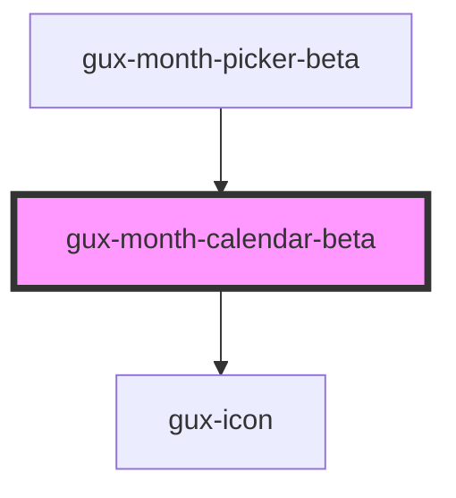

# gux-month-calendar-beta

<!-- Auto Generated Below -->

## Properties

| Property            | Attribute   | Description                | Type          | Default     |
| ------------------- | ----------- | -------------------------- | ------------- | ----------- |
| `lastPickedMonth`   | --          |                            | `HTMLElement` | `undefined` |
| `maxMonth`          | `max-month` | The max month selectable   | `string`      | `''`        |
| `maxYear`           | `max-year`  | The max year selectable    | `string`      | `''`        |
| `minMonth`          | `min-month` | The min month selectable   | `string`      | `''`        |
| `minYear`           | `min-year`  | The min year selectable    | `string`      | `''`        |
| `monthsObject`      | --          |                            | `object`      | `{}`        |
| `monthsObjectShort` | --          |                            | `object`      | `{}`        |
| `value`             | `value`     | The current selected month | `string`      | `''`        |

## Events

| Event   | Description                         | Type                  |
| ------- | ----------------------------------- | --------------------- |
| `input` | Triggered when user selects a month | `CustomEvent<string>` |

## Methods

### `focusPreviewMonth() => Promise<void>`

Focus the preview month

#### Returns

Type: `Promise<void>`

### `resetCalendarView(value: string) => Promise<void>`

Reset calendar view to show first selected date

#### Returns

Type: `Promise<void>`

### `setValue(month: string, year: string) => Promise<void>`

Sets new value and rerender the calendar

#### Returns

Type: `Promise<void>`

## Dependencies

### Used by

 - [gux-month-picker-beta](../gux-month-picker)

### Depends on

- [gux-icon](../../stable/gux-icon)

### Graph

----------------------------------------------

*Built with [StencilJS](https://stenciljs.com/)*
