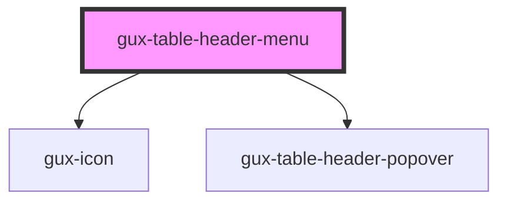

# gux-row-select

<!-- Auto Generated Below -->

## Properties

| Property           | Attribute           | Description | Type      | Default |
| ------------------ | ------------------- | ----------- | --------- | ------- |
| `dropdownDisabled` | `dropdown-disabled` |             | `boolean` | `false` |

## Slots

| Slot                    | Description                                                  |
| ----------------------- | ------------------------------------------------------------ |
| `"default"`             | Required slot for gux-all-row-select element                 |
| `"header-menu-options"` | Optional slot for gux-list containing gux-list-item children |

## Dependencies

### Depends on

- [gux-icon](../../../stable/gux-icon)
- [gux-table-header-popover](gux-table-header-popover)

### Graph

----------------------------------------------

*Built with [StencilJS](https://stenciljs.com/)*
