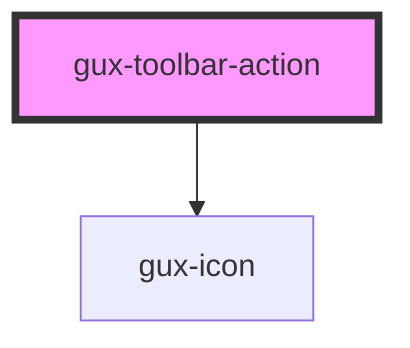

# gux-toolbar-action

<!-- Auto Generated Below -->

## Properties

| Property  | Attribute | Description | Type      | Default     |
| --------- | --------- | ----------- | --------- | ----------- |
| `icon`    | `icon`    |             | `string`  | `undefined` |
| `primary` | `primary` |             | `boolean` | `undefined` |

## Methods

### `guxActionFocus() => Promise<void>`

#### Returns

Type: `Promise<void>`

### `guxGetActiveAction() => Promise<boolean>`

#### Returns

Type: `Promise<boolean>`

### `guxSetActive(active: boolean) => Promise<void>`

#### Returns

Type: `Promise<void>`

## Dependencies

### Depends on

- [gux-icon](../../../stable/gux-icon)

### Graph

----------------------------------------------

*Built with [StencilJS](https://stenciljs.com/)*
