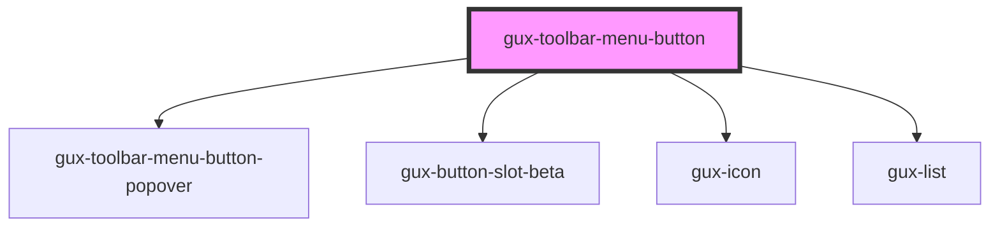

# gux-toolbar-menu-button

<!-- Auto Generated Below -->

## Properties

| Property | Attribute | Description | Type      | Default |
| -------- | --------- | ----------- | --------- | ------- |
| `isOpen` | `is-open` |             | `boolean` | `false` |

## Events

| Event    | Description                   | Type               |
| -------- | ----------------------------- | ------------------ |
| `closed` | Triggered when menu is closed | `CustomEvent<any>` |
| `open`   | Triggered when menu is opened | `CustomEvent<any>` |

## Dependencies

### Depends on

- [gux-toolbar-menu-button-popover](gux-toolbar-menu-button-popover.less)
- [gux-button-slot-beta](../../gux-button-slot)
- [gux-icon](../../../stable/gux-icon)
- [gux-list](../../../stable/gux-list)

### Graph

----------------------------------------------

*Built with [StencilJS](https://stenciljs.com/)*
