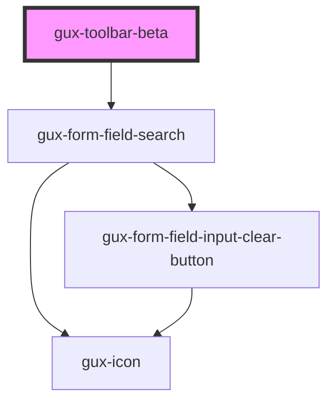

# gux-toolbar-beta

<!-- Auto Generated Below -->

## Properties

| Property | Attribute | Description | Type      | Default     |
| -------- | --------- | ----------- | --------- | ----------- |
| `search` | `search`  |             | `boolean` | `undefined` |

## Slots

| Slot       | Description             |
| ---------- | ----------------------- |
| `"filter"` | Slot for filter option. |

## Dependencies

### Depends on

- [gux-form-field-search](../../stable/gux-form-field/components/gux-form-field-search)

### Graph

----------------------------------------------

*Built with [StencilJS](https://stenciljs.com/)*
