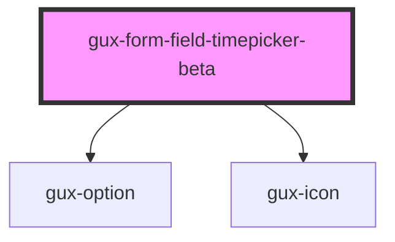

# gux-form-field-timepicker

<!-- Auto Generated Below -->

## Properties

| Property          | Attribute             | Description                                                         | Type                                    | Default     |
| ----------------- | --------------------- | ------------------------------------------------------------------- | --------------------------------------- | ----------- |
| `dropdownValue`   | `dropdown-value`      | Indicate the dropdown input value                                   | `string`                                | `''`        |
| `hoursValue`      | `hours-value`         | Hours input value                                                   | `string`                                | `'12'`      |
| `interval`        | `interval`            | Time interval between suggested times in dropdown list - default 60 | `"15" \| "30" \| "60"`                  | `'60'`      |
| `labelPosition`   | `label-position`      |                                                                     | `"above" \| "beside" \| "screenreader"` | `undefined` |
| `minutesValue`    | `minutes-value`       | Minutes input value                                                 | `string`                                | `'00'`      |
| `opened`          | `opened`              | Suggested times dropdown list state - opened/closed                 | `boolean`                               | `false`     |
| `optionSelected`  | `option-selected`     | True when suggested time option is selected                         | `boolean`                               | `false`     |
| `timeFormat`      | `time-format`         | User's locale for 12h or 24h time format                            | `string`                                | `'12h'`     |
| `toggleAmPMValue` | `toggle-am-p-m-value` | AM/PM toggle value                                                  | `string`                                | `''`        |

## Slots

| Slot      | Description                     |
| --------- | ------------------------------- |
| `"error"` | Optional slot for error message |
| `"input"` | Required slot for input tag     |
| `"label"` | Optional slot for label tag     |

## Dependencies

### Depends on

- [gux-option](../../../gux-listbox/gux-option)
- [gux-icon](../../../gux-icon)

### Graph

----------------------------------------------

*Built with [StencilJS](https://stenciljs.com/)*
