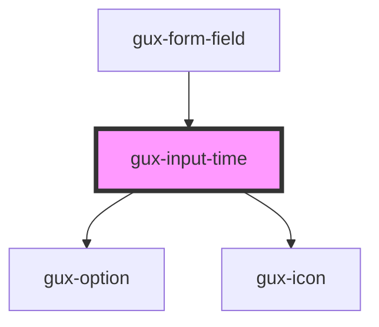

# gux-input-time

<!-- Auto Generated Below -->

## Properties

| Property          | Attribute             | Description                                                         | Type           | Default |
| ----------------- | --------------------- | ------------------------------------------------------------------- | -------------- | ------- |
| `dropdownValue`   | `dropdown-value`      | Indicate the dropdown input value                                   | `string`       | `''`    |
| `hoursValue`      | `hours-value`         | Hours input value                                                   | `string`       | `'12'`  |
| `interval`        | `interval`            | Time interval between suggested times in dropdown list - default 15 | `"15" \| "30"` | `'15'`  |
| `minutesValue`    | `minutes-value`       | Minutes input value                                                 | `string`       | `'00'`  |
| `opened`          | `opened`              | Suggested times dropdown list state - opened/closed                 | `boolean`      | `false` |
| `optionSelected`  | `option-selected`     | True when suggested time option is selected                         | `boolean`      | `false` |
| `timeFormat`      | `time-format`         | User's locale for 12h or 24h time format                            | `string`       | `'12h'` |
| `toggleAmPMValue` | `toggle-am-p-m-value` | AM/PM toggle value                                                  | `string`       | `''`    |

## Slots

| Slot      | Description                          |
| --------- | ------------------------------------ |
| `"input"` | Required slot for input[type="time"] |

## Dependencies

### Used by

 - [gux-form-field](../..)

### Depends on

- [gux-option](../../../gux-dropdown/gux-option)
- [gux-icon](../../../gux-icon)

### Graph

----------------------------------------------

*Built with [StencilJS](https://stenciljs.com/)*
