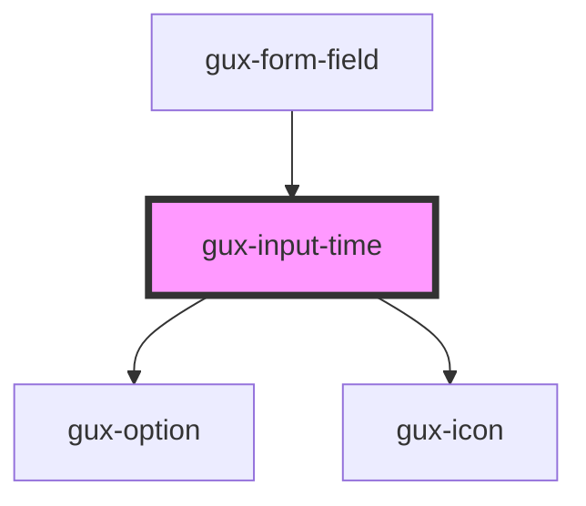

# gux-input-time

<!-- Auto Generated Below -->

## Properties

| Property          | Attribute             | Description                                            | Type      | Default |
| ----------------- | --------------------- | ------------------------------------------------------ | --------- | ------- |
| `hoursValue`      | `hours-value`         | Hours input value                                      | `string`  | `'12'`  |
| `interval`        | `interval`            | Time interval between suggested times in dropdown list | `string`  | `'15'`  |
| `minutesValue`    | `minutes-value`       | Minutes input value                                    | `string`  | `'00'`  |
| `opened`          | `opened`              | Suggested times dropdown list state - open/closed      | `boolean` | `false` |
| `toggleAmPMValue` | `toggle-am-p-m-value` | AM/PM toggle value                                     | `string`  | `''`    |
| `value`           | `value`               | Indicate the dropdown input value                      | `string`  | `''`    |

## Slots

| Slot      | Description                          |
| --------- | ------------------------------------ |
| `"input"` | Required slot for input[type="time"] |

## Dependencies

### Used by

 - [gux-form-field](../..)

### Depends on

- [gux-option](../../../gux-dropdown/gux-option)
- [gux-icon](../../../gux-icon)

### Graph

----------------------------------------------

*Built with [StencilJS](https://stenciljs.com/)*
